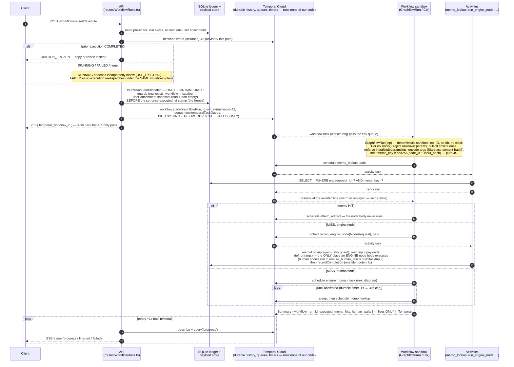
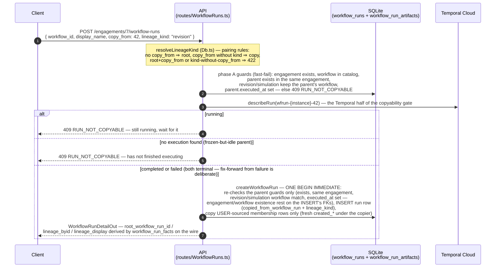
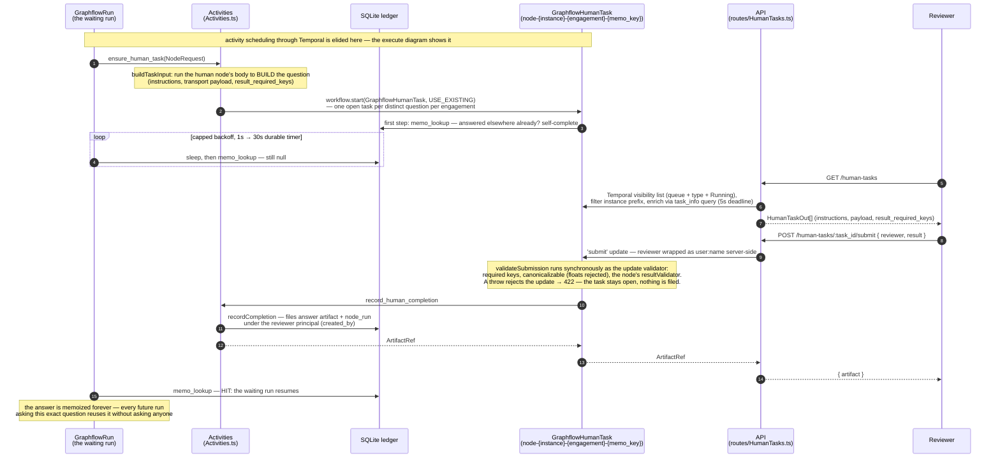

# graphflow

An engagement-scoped, memoized workflow engine for professional-services work (the demo domain is
tax preparation). Workflows are TypeScript code executed durably on Temporal; every computed
answer is filed in an insert-only SQLite ledger keyed by the question asked (node id plus
canonicalized inputs). A workflow run is a named, editable set of attached documents until its
first dispatch, which freezes it forever; further work happens on a FAMILY of copies, revisions,
and simulations of it — and because the memo ledger is keyed by content, not by run, a no-change
revision replays entirely from memo (zero node bodies execute, zero humans are re-asked), and a
copy with one corrected document recomputes only the chains that document feeds.

This README is the technical design document. It describes the current implementation with
file and symbol anchors so a reader (or a fresh coding session) can verify every claim without
re-discovering the codebase. Operational instructions are at the end. The database schema is
transcribed in `schema.dbml`. Rules for writing about this codebase are in `AGENTS.md`.
Everything else at the repo root: `typescript_StyleAndRules/` is the snapshot of the monorepo
standards that the "Deviations" section of `backend/README.md` is written against; `agents/`,
`DO_NOT_READ*/`, and `legacy/` hold retired material and are not documentation.

**Current state (frozen 2026-07-20).** The backend is the product and is current. The frontend
(`frontend/`) predates the latest wire-contract changes and is KNOWN BROKEN against the current
API. The drift, oldest first:

- `task_queue` and `code_hash` left the wire; `source`, `origin`, and `input_kinds` arrived
  (`input_kinds` has since been renamed — see the renames bullet below and "Wire contracts").
- The additive hygiene fields arrived: `updated_by`/`updated_at` on artifacts/workflow
  runs/engagements, `created_by` on engagements, `created_by`/`created_at` on node runs,
  `created_at`/`updated_at` on catalog workflows; reviewer names now arrive as `user:<name>`
  principals.
- The 2026-07-20 global renames: the domain term "kind" became `nodeparamslot` everywhere (wire
  keys `kind`→`nodeparamslot`, `kinds`→`nodeparamslots`, `output_kind`→`output_nodeparamslot`,
  `input_kinds`→`input_nodeparamslots`, the upload multipart field and browse query param
  included), and the `label` field on engagements/artifacts/workflow runs became `display_name`
  (request bodies and responses).
- The 2026-07-20 lineage/freeze change: the "workspace" noun is retired (the rows were always
  `workflow_runs`; the old wire key `stats.workspaces` is now `stats.workflow_runs`), run detail
  and list gained `lineage_kind`, `executed_at`, `root_workflow_run_id`, `lineage_byid`, and
  `lineage_display`, PATCH lost `workflow_id`, execute lost `?supersede`, and 409 now means
  `RUN_FROZEN` or `RUN_NOT_COPYABLE` (SNAPSHOT_CHANGED is gone).

The frontend still speaks the old vocabulary. Porting it, and all e2e work, is deliberately
deferred.

## Vocabulary and the domain model

The vocabulary is load-bearing; every later section leans on it:

- A **workflow** is the catalog definition (a row of `workflows`, authored in code).
- A **workflow run** is the business instance (a row of `workflow_runs`).
- An **execution** is the Temporal side of dispatching a workflow run.
- A **node run** is a ledger fact (a row of `node_runs`): one distinct answered question.

Six concepts carry the system. Each maps to a table in `schema.dbml` (source of truth: the
`SCHEMA` constant in `backend/src/infrastructure/db/Db.ts`).

- **Engagement** (`engagements`) — the isolation boundary. Artifact identity and memo lookups
  are engagement-scoped; across engagements nothing is ever shared. One boundary serves both
  reuse and confidentiality, on purpose.
- **Artifact** (`artifacts`) — an immutable value: uploaded document, questionnaire answers, or
  a computed result. Identity is content, never provenance:
  `UNIQUE (engagement_id, nodeparamslot, hash)` where `hash` is sha256 of the payload bytes.
  Identical bytes under one nodeparamslot converge to one row; re-uploading the same document
  revives all work that consumed it. Payload bytes live outside the db, content-addressed at
  `{engagement_id}/{content_hash}` under the storage root (`writePayload` in
  `backend/src/infrastructure/storage/Storage.ts`, write-once).
- **Nodeparamslot** (`nodeparamslots`) — the type of an artifact and a first-class business
  object. Every nodeparamslot has an authored `source`, the channel data of that nodeparamslot
  enters through: `upload`, `questionnaire`, or `email` (leaf channels: supplied by users) or
  `computed` (produced by nodes). `artifacts.nodeparamslot` and `nodes.output_nodeparamslot` are
  foreign keys into `nodeparamslots`, so an unpublished nodeparamslot cannot enter the ledger.
- **Node** — one computation step, declared with `defineNode`/`defineHumanNode`
  (`backend/src/domain/registry/Registry.ts`). A node declares its `name` (the node id), its
  `outputNodeparamslot`, and `inputNodeparamslots` — a total map from every parameter to the
  artifact nodeparamslot it consumes, or `null` for a scalar argument. `inputNodeparamslots` IS
  the parameter declaration; `paramNames` is derived from its keys. The catalog mirrors nodes
  into the `nodes` and `node_input_nodeparamslots` tables.
- **Workflow** (`workflows` + `workflow_nodeparamslots`) — a versioned composition: a declared
  nodeparamslot vocabulary, a node list, and a `run(ctx)` function that IS the DAG (plain
  TypeScript control flow calling `ctx.node(...)`). Declared with `defineWorkflow`; every version
  is listed in the `ALL_WORKFLOWS` manifest (`backend/src/workflows/index.ts`).
- **Workflow run** (`workflow_runs` + `workflow_run_artifacts`) — the business instance: a named
  set of attached artifacts plus a pinboard of results, editable until frozen. A workflow run is
  still NOT an execution record — execution state lives only in Temporal. Three properties define
  its lifecycle:
  - **The freeze** (`executed_at`): first dispatch stamps this write-once column inside
    `freezeAndLoadDispatch`'s transaction (Db.ts), after which the user-attachment set is
    immutable — user attach/detach reject with code `RUN_FROZEN` — while engine attach-back
    continues and `display_name`/archive stay editable. A business run happens at most once;
    further work is a new run in the family.
  - **`lineage_kind`** records what a creation-from-parent MEANS: `root` and `copy` START a
    family (`copy` may target a different workflow — a different DAG is always a root-class
    copy), `revision` and `simulation` EXTEND one and must keep the parent's workflow
    (`createWorkflowRun` in Db.ts). Copying takes the parent's USER-sourced membership rows
    only — engine results are never copied; the child recomputes or memo-hits them.
  - **The copyability gate**: the parent must be frozen AND its Temporal execution terminal —
    completed and failed both count (fix-forward from a failure is deliberate); never-executed
    drafts and running parents are uncopyable, refused with `RUN_NOT_COPYABLE` (the create route
    asks Temporal via `describeRun` at gate time; there is deliberately no `completed_at`
    column).

  Lineage is derived, never stored: the `workflow_run_facts` view (in `SCHEMA`, Db.ts)
  recomputes `root_workflow_run_id`, `lineage_byid`, and `lineage_display` from
  `copied_from_workflow_run` + `lineage_kind` on every read, so renaming the family root flows
  through instantly. Membership rows carry `source: user | engine` (run-membership provenance,
  distinct from artifact origin); user-attach promotes an engine row (`source` flips, the
  promoter lands in the membership's `updated_*`, first-attach `created_*` survives), a
  user→user re-attach is a true no-op, engine-attach never demotes; detaching is the only
  user-facing DELETE in the system.

The ledger of computations is `node_runs` + `node_run_inputs`: one `node_runs` row per DISTINCT
answered question (not per execution — memo hits insert nothing, and run-button presses are not
recorded here; the only dispatch fact in the db is `workflow_runs.executed_at`), with
`node_run_inputs` holding the consumed-artifact edges. Ledger tables are insert-only; the mutable
ledger columns are `artifacts.display_name` and its `updated_by`/`updated_at` stamps
(`renameArtifact` in Db.ts).

### Actors and hygiene columns

Every table carries a tiered audit block (full tiering rationale in `schema.dbml` Conventions):
entity tables (`engagements`, `artifacts`, `workflow_runs`) have
`created_by`/`created_at`/`updated_by`/`updated_at`/`deleted_at`; `node_runs` has `created_*`
only (insert-only memo ledger); `workflow_run_artifacts` has `created_*` + `updated_*`
(promotion); catalog masters have `created_at` + `updated_at` (publish stamps, bumped only when
the mirrored row's own columns change — an identical republish is a no-op); `meta` and the
publish/edge mirrors are exempt. `created_*` is the FIRST filer — convergence never re-dates it;
`updated_*` is NULL until first updated (the idempotent promote/publish paths are guarded so
no-ops never stamp; request-driven rename/PATCH/archive stamp per request). ONE deliberate
exemption: the `executed_at` freeze stamp does not stamp `updated_*` — it is itself the
write-once audit stamp of the dispatch event, and the dispatch path has no attributable actor
(hygiene comment in Db.ts). `deleted_at` is dormant (always NULL, no reader filters — reserved
for a future soft delete).

Actor columns hold **principals**: `'<type>[:<name>]'` with type `user | engine | system |
agent` — e.g. `engine`, `user:thet`, `user:Priya Sharma`, `agent:auto-approver`; bare `user` is
the anonymous caller. The grammar lives in `backend/src/domain/principal/Principal.ts`
(bundle-safe) and is asserted at every Db write boundary and in the human-task submit validator.
The API wraps submitted reviewer names as `user:<name>` server-side; names are free text (colons
allowed) and — no auth existing (invariant 9) — caller-asserted: an audit trail, not an
authorization record. The reviewer principal on a human answer's `created_by` is the system's
only record of who approved it.

## The identity model (what makes reuse safe)

Two hashes define everything:

- **Artifact identity** = `(engagement_id, nodeparamslot, sha256(payload bytes))`. No provenance
  inside.
- **Question identity (the memo key)** = `sha256(node_id ':' input_hash)` (`memoKey` in
  `backend/src/domain/canonical/Canonical.ts`), where `input_hash` is the hash of the canonical
  argument map. Engagement scoping applies at lookup via `UNIQUE (engagement_id, memo_key)` on
  `node_runs` — never inside the hash.

Consequences:

- **The node's declared name is its version identity (the naming contract).** There is no code
  hash. A behavior change — body, helper, validator, output nodeparamslot, executor — REQUIRES a
  rename (`calculate_tax` → `calculate_tax_v2`); an unchanged name keeps serving previously
  memoized answers, including human ones. Nothing mechanical catches a forgotten rename;
  `validateCatalog` (Registry.ts, run by every publish) catches what it can — the same node id
  declared with a different shape (executor/outputNodeparamslot/inputNodeparamslots/displayName)
  across workflows is a publish error — and the rest is contract.
- **Canonical JSON is the hashing substrate** (`canonicalBytes` in Canonical.ts): sorted keys,
  NFC-normalized strings, floats banned (money is decimal strings end to end — `DecimalString`
  helpers in `backend/src/domain/money/`). Artifact-valued arguments hash as
  `{$artifact: <content hash>}` — ids, paths, and history never enter a hash. Absent parameters
  hash as explicit `null`, so omitted/undefined/null calls produce the same key; parameter
  reordering is a memo HIT by design (sorted keys), while adding, renaming, or removing a
  parameter is a miss.
- **Provenance is derived, never stored — two read models, one doctrine.**
  - `artifact_facts` (a view in `SCHEMA`, Db.ts): `artifacts` has no producer column; the view
    derives `produced_by_node_run` (earliest `node_runs` row whose `output_artifact_id` points
    at the artifact — several runs can converge on one artifact) and `origin`: `produced` when a
    producing run exists, else `override` for a hand-supplied computed nodeparamslot, else the
    nodeparamslot's authored source.
  - `workflow_run_facts` (same file): `workflow_runs` stores only `copied_from_workflow_run` +
    `lineage_kind`; the view's recursive walk derives `root_workflow_run_id`, `lineage_depth`,
    `lineage_byid` (the family-root-to-self id path), and `lineage_display` on every read. The
    CHECKs on `workflow_runs` (root ⇔ no parent; no self-parent) make the walk total and
    cycle-free.

  Read models read the views (`getArtifact`, `browseArtifacts`, `getWorkflowRun`,
  `listWorkflowRuns`, the API serializers); the memo and write paths (`memoLookup`,
  `recordCompletion`, `supplyArtifact`, `createWorkflowRun`) stay on base tables. Nothing stored
  can diverge from lineage.

Concrete scenario: last month's run is frozen, so the user creates a revision of it, attaches a
corrected brokerage statement, and executes. The OCR node's memo key changes (new `$artifact`
hash) so OCR re-runs; its verify question is new, so a reviewer is asked once; every chain fed by
unchanged documents memo-hits; the fold, calculator, and report re-run because their inputs
changed; the returned `Summary` lists exactly which node ids executed, memo-hit, and waited on
humans.

## The lifecycle

Three sequences cover every user-visible path: executing a run, creating a
copy/revision/simulation, and answering a human task.

### Executing a workflow run



The same walk in prose:

1. `POST /workflow-runs/:id/execute` (routes/WorkflowRuns.ts) fast-fails a run with zero user
   attachments, then calls the gateway's `startWorkflowRun` (Deps.ts → Runtime.ts). There is no
   querystring — `?supersede` is gone: the row freezes at first dispatch, so a snapshot can
   never drift under an open run and there is nothing to supersede.
2. `startWorkflowRun` (Runtime.ts) describes `wfrun-{instance}-{workflow_run_id}` first:
   COMPLETED → RuntimeError coded `RUN_FROZEN` (API → 409 — a business run happens at most once;
   create a copy or revision instead); RUNNING attaches idempotently below (USE_EXISTING —
   double-click safety); any other closed state or not-found proceeds — **retry-in-place** under
   the SAME Temporal id, so infra noise never mints business revisions. Only
   `WorkflowNotFoundError` is swallowed by the describe; every other error propagates.
3. `freezeAndLoadDispatch` (Db.ts) runs ONE `BEGIN IMMEDIATE`: every deterministic guard (row
   exists, workflow in the catalog, snapshot non-empty) BEFORE the `executed_at` stamp (set-once
   via `WHERE executed_at IS NULL`, no `updated_*`), with the user-attachment snapshot
   (user-sourced, hash-ordered) read in the same transaction — a doomed dispatch rolls back
   without freezing the row, and freeze and snapshot can never tear apart. A retry against an
   already-frozen row is a no-op stamp, not an error.
4. `client.workflow.start` dispatches workflow type `RUN_WORKFLOW_TYPE` (`'GraphflowRun'`,
   Ids.ts) on the env task queue with `RUN_START_POLICIES` (Runtime.ts): conflict policy
   USE_EXISTING plus reuse policy ALLOW_DUPLICATE_FAILED_ONLY — the Temporal server, not the
   advisory describe, is the arbiter that a COMPLETED run never re-executes;
   `WorkflowExecutionAlreadyStartedError` maps to `RUN_FROZEN` (`rethrowStartError`). Dispatch
   metadata lives nowhere in the db: run and recovery agree on the env queue by construction.
   The race in the describe-then-start gap resolves server-side: describe says RUNNING, the run
   completes before start — the reuse policy refuses the start
   (`WorkflowExecutionAlreadyStartedError` → `RUN_FROZEN` → 409), the same answer the advisory
   describe gives; no second execution ever starts over a COMPLETED run (Runtime.test.ts pins
   the refusal).
5. `GraphflowRun` (Workflows.ts) executes in the deterministic sandbox — no I/O, no clock, no
   db. It resolves the workflow from the compiled-in registry and calls its `run(ctx)`.
6. `Ctx.node(def, args)` (Context.ts) is the memoize-or-execute walk, per node call: verify the
   node is registered for this workflow; reject unknown parameters; null-fill absent ones;
   enforce `inputNodeparamslots` (every artifact argument must carry the declared nodeparamslot —
   single, list, or nested; scalar params accept no artifacts); encode arguments three ways
   (hash form, transport form, input artifact ids); mint
   `memo_key = sha256(node_id ':' input_hash)`; ask the `memo_lookup` activity. Hit → attach the
   existing artifact to the workflow run and return its handle — the node body never runs. Miss
   + engine node → `run_engine_node` executes the body node-side and files the completion. Miss
   + human node → `ensure_human_task` (next diagram), then the run polls the memo with capped
   backoff (1s → 30s) as a durable timer until the answer appears.
7. `recordCompletion` (Db.ts) is the one atomic, idempotent completion transaction: re-check the
   memo (activity-retry guard), assert the output nodeparamslot is `computed` (runs may not
   produce leaf nodeparamslots), insert the artifact
   (`ON CONFLICT (engagement_id, nodeparamslot, hash) DO NOTHING` — the convergence path), insert
   the `node_runs` row (SQLite assigns the id) and `node_run_inputs`, attach to the requesting
   workflow run — all under one `filedAt` stamp. A lost race on
   `UNIQUE (engagement_id, memo_key)` resolves to the winner via the catch path.
   `run_engine_node` byte-encodes results by contract: `Uint8Array` → octet-stream, string →
   text/plain, anything else must canonicalize (`toOutputBytes` in Activities.ts).
8. Progress streams over SSE (`GET /workflow-runs/:id/progress`, routes/WorkflowRuns.ts):
   describe + `progress` query each ~1s until terminal; idle streams close silently after 10s
   (`pumpProgress`). The per-run `Summary` lives only in Temporal — never in SQLite.
9. Worker recovery: on startup `adoptOpenWorkflows` (Runtime.ts) signals this instance's open
   workflows so their stickiness transfers off the dead worker's queue instead of stalling
   queries.

### Creating a copy, revision, or simulation



Notes verified against the code:

- Copy is the ONLY creation-from-parent mechanism; `lineage_kind` records what it means
  (`resolveLineageKind` in Db.ts, shared by the route's fast-fail and `createWorkflowRun`'s
  authoritative in-tx path).
- Phase A (routes/WorkflowRuns.ts) runs before the Temporal describe, so a never-executed parent
  is rejected there (`executed_at` null → `RUN_NOT_COPYABLE`); a null `describeRun` result after
  phase A therefore specifically means a frozen-but-idle parent (froze, but the dispatch never
  reached Temporal).
- The describe runs between connection scopes, never inside one (`withConn` is synchronous), so
  the Temporal half of the gate cannot be re-checked inside the create transaction. `executed_at`
  is set-once and terminality is monotonic, so the describe-then-create window only ever rejects
  conservatively (route comment) — see "Known accepted gaps".
- Engine results are never copied: the membership copy takes `source='user'` rows only, as NEW
  memberships (fresh `created_*` under the copying actor). The child recomputes or memo-hits the
  engine results.
- Lineage never enters memo keys (invariant 1), which is why a no-change revision executes as a
  pure memo replay.

### Answering a human task



Notes verified against the code:

- The inbox is a Temporal visibility query, not a db table: `listTaskWorkflows` (Deps.ts) lists
  Running `GraphflowHumanTask` workflows on the env task queue; routes/HumanTasks.ts filters by
  the instance's workflow-id prefix (foreign prefixes 404 before touching Temporal on submit) and
  enriches per task via the 5s-deadline `task_info` query, dropping tasks that raced to
  completion or report `open: false` (visibility is eventually consistent).
- `ensure_human_task` (Activities.ts) deliberately has no exception handling on the start: with
  USE_EXISTING an existing or completed task never raises, and a start after completion spawns a
  run that self-completes via its first-step memo check
  (`GraphflowHumanTask` in Workflows.ts).
- `validateSubmission` (Workflows.ts) also rejects a reviewer that is not a principal — that
  check only fires for out-of-contract direct Temporal clients, because the API route and CLI
  wrap bare names as `user:<name>` first.
- Convergence back into the waiting run is the memo poll in `Ctx.node` (Context.ts): the run
  never observes the task workflow directly, only the ledger fact its completion filed.
- Idempotent re-submit returns the already-filed ref; a task whose `submit` races its
  self-completion still answers the reviewer (`condition(allHandlersFinished)` before returning).

## Source layout (the map)

```
backend/                    the product (Node 22+, npm — not yarn)
  src/domain/               pure + bundle-safe (imported by Temporal sandbox code; no node:*)
    canonical/Canonical.ts    canonical JSON, sha256Hex, hashValue, memoKey — the hashing contract
    registry/Registry.ts      defineNode/defineHumanNode/defineWorkflow, buildRegistry,
                              nodeparamslotClasses, validateCatalog — definitions and publish validation
    principal/Principal.ts    the '<type>[:<name>]' actor grammar (isPrincipal/assertPrincipal)
    money/DecimalString.ts    BigInt decimal-string arithmetic (ROUND_HALF_UP), no floats
    artifact/                 ArtifactRef (wire shape) + ArtifactHandle (loader-injected payload access)
    json/JsonValue.ts         the JSON value type + zod schema
  src/workflows/            the authored product — one folder per workflow version
    index.ts                  ALL_WORKFLOWS manifest; static imports feed the Temporal bundler
    nodes_shared/             version-spanning library (not a workflow folder — no workflow.ts):
                              enums.ts (SharedNodeparamslot/SharedNodeId/SHARED_NODEPARAMSLOTS), helpers.ts,
                              one node per file (ocr_brokerage_statement.ts, ocr_payment_slip.ts,
                              verify_txns.ts, append_to_master.ts)
    tax_demo_workflow/        enums.ts (Nodeparamslot/NodeId/NODEPARAMSLOTS — the version's contract) +
                              nodes_special/ (calculate_tax.ts, build_report.ts — 25%) +
                              workflow.ts (defineWorkflow + the run() DAG, nothing else)
    tax_demo_workflow_v2/     same shape: 24% rate + residency questionnaire; changed nodes are
                              RENAMED (nodes_special/calculate_tax_v2.ts, build_report_v2.ts)
  src/temporal/             the execution engine
    Workflows.ts              bundle entry; GraphflowRun + GraphflowHumanTask (function name ==
                              Temporal workflow type); queries progress/task_info; submit update
                              + validateSubmission
    Context.ts                Ctx — the memoize-or-execute walk; encodeArgs; enforceInputNodeparamslots
    Activities.ts             node-side I/O: memo_lookup, attach_artifact, run_engine_node,
                              ensure_human_task, record_human_completion (keys == wire activity names)
    Runtime.ts                Temporal client/worker factories; startWorkflowRun (the dispatch:
                              describe fast path → freezeAndLoadDispatch → start) with
                              RUN_START_POLICIES + rethrowStartError (unit-pinned in
                              Runtime.test.ts); adoptOpenWorkflows recovery sweep
    Ids.ts                    RUN_WORKFLOW_TYPE/HUMAN_TASK_WORKFLOW_TYPE constants + workflow-id helpers
  src/infrastructure/
    db/Db.ts                  SCHEMA (the schema source of truth, incl. the artifact_facts and
                              workflow_run_facts views), publishCatalog, supplyArtifact,
                              recordCompletion, createWorkflowRun + resolveLineageKind,
                              freezeAndLoadDispatch, frozenRunError, catalogSnapshot,
                              artifactLineage, read models
    storage/Storage.ts        content-addressed write-once payload store (local dir standing in for S3/GCS)
    env/Env.ts                zod-validated env (.env tolerated, shell wins)
  src/api/                  the HTTP layer — the only thing a frontend talks to; routes reach
                            Temporal only through the TemporalGateway seam (Deps.ts)
    App.ts                    fastify wiring, error envelope (ValidationError→422, NotFoundError→404,
                              RuntimeError with context.code in CONFLICT_CODES
                              {RUN_FROZEN, RUN_NOT_COPYABLE}→409, else 422)
    Bootstrap.ts              startup order: env → initDb → buildRegistry → publishCatalog →
                              client → optional embedded worker → listen
    Deps.ts                   ApiDeps + the narrow TemporalGateway seam (what tests stub):
                              describeRun, failureMessage, queryProgress, queryTaskInfo,
                              listTaskWorkflows, startWorkflowRun, executeSubmit
    Schemas.ts / Serializers.ts  zod request schemas + row→wire mappers (wire is snake_case)
    routes/                   Catalog, Engagements, Artifacts, WorkflowRuns (create/execute/status/SSE),
                              HumanTasks
  src/cli/                  init / worker / demo / seed / tasks / submit / show / download
                            (Inbox.ts holds the demo auto-approver, hardwired to verify_txns)
  src/shared/errors/        Errors.ts — the whole error taxonomy: ValidationError, NotFoundError,
                            RuntimeError, isSqliteConstraintError (local mirror of
                            @multiplier/lib-shared-errors; do not add other error classes)
  src/index.ts              the process entry (npm run dev/start) + the package barrel for the
                            monorepo move (exports buildApp, bootstrap, ApiDeps, TemporalGateway)
  scripts/check-workflows.ts  layout discipline (see below); cleanup-temporal.ts (e2e teardown)
  sample_docs/              mock "PDF" documents (.txt) used by seed/demo/tests
frontend/                   Next.js UI — currently behind the wire contract, port deferred
schema.dbml                 the schema, transcribed from SCHEMA in Db.ts (kept in sync by hand)
```

Layout contracts, enforced by `npm run check:workflows` (`backend/scripts/check-workflows.ts`):
a workflow folder is a directory under `src/workflows/` containing a `workflow.ts`; its name IS
the workflow id; every such folder is listed in `ALL_WORKFLOWS` and vice versa; and every node
owns a file named after its node id — `nodes_shared/<node_id>.ts` or
`<workflow_id>/nodes_special/<node_id>.ts` (the check is existence-only; one-file-exactly is
convention). Publish never reads the filesystem, so an unlisted folder would silently never
publish — this script is the guard.

**The sharing contract** (`nodes_shared/enums.ts` states it in code): the memo key is global by
node name, so same-named nodes across workflows were always one question universe — shared nodes
make the source match that. One name, one behavior, everywhere: an edit to a shared node changes
every workflow that lists it, so a behavior change there forces a rename, which re-executes in
every importing workflow. Versioned behavior lives only in `nodes_special/`. Vocabularies are
`as const` objects (not TS enums) because per-workflow vocabularies are composed by spreading
`SharedNodeparamslot`/`SHARED_NODEPARAMSLOTS`; no raw nodeparamslot or node-id string literals
appear at definition sites.

## The catalog (publish)

`publishCatalog` (Db.ts) mirrors the in-memory registry into the db at every boot and `cli init`.
First it runs `validateCatalog` (Registry.ts) over the registry — never over possibly-stale db
rows. Checks: no duplicate nodeparamslot declarations per workflow; every `outputNodeparamslot`
and consumed nodeparamslot is declared; authored source reconciles with the derived class
(`nodeparamslotClasses`: a nodeparamslot is `computed` iff some node in the workflow produces
it — a produced nodeparamslot must be authored `computed`; an unproduced `computed` nodeparamslot
must be flagged `intake: true`, meaning another workflow's output attached as input); one
nodeparamslot = one source+display globally; one node id = one declared shape globally.

Then, in one transaction: `workflows` and `nodeparamslots` and `nodes` are upsert-only (retired
rows persist — they are FK parents of the ledger, and a workflow run pinned to a retired workflow
must fail loud, not vanish); `workflow_nodeparamslots` (membership) and `node_input_nodeparamslots`
(param → nodeparamslot) are DELETE-then-INSERT, so declarations removed from code stop lingering.
`catalogSnapshot` (Db.ts) serves the mirror with `leaf` derived per workflow in SQL (no node of
the workflow produces the nodeparamslot) — leafness is never stored. Known accepted skew: retired
`nodes` rows still count as producers in that derivation until a db reset.

## Supplying artifacts

`POST /engagements/:id/artifacts` (routes/Artifacts.ts) accepts a multipart upload with a
`nodeparamslot` field. `supplyArtifact` (Db.ts) rejects nodeparamslots absent from the published
vocabulary BEFORE writing the payload (no orphaned blobs). Supplying a `computed` nodeparamslot
stays legal — hand-staging a corrected intermediate is supported and derives `origin: 'override'`.
An optional `workflow_run_id` multipart field attaches the artifact to a run in the same request;
the route checks that the run belongs to the same engagement (422 otherwise) and that it is not
frozen (409 RUN_FROZEN) BEFORE filing, so a rejected upload-attach files nothing.

The questionnaire channel: with multipart field `canonical_json=true`, the route parses the
upload as JSON and re-serializes through `canonicalBytes` before supply
(`canonicalizeIfRequested`, routes/Artifacts.ts) — the frontend is forbidden from producing
canonical JSON. A re-answered identical questionnaire (any key order, any whitespace) therefore
converges on the same artifact and revives every downstream memo hit.
`tax_demo_workflow_v2` demonstrates it end to end: `residency_answers` (source `questionnaire`)
feeds `calculate_tax_v2`. `email` is a declared source value with no channel behind it yet.

## API reference

Every endpoint, enumerated from the five route files under `backend/src/api/routes/`. Wire shapes
are named by their types in Serializers.ts/Schemas.ts. Status codes appear where they ARE the
contract; the error envelope is always `{ detail }` (App.ts).

### Catalog (routes/Catalog.ts)

| Method | Path | Description |
| --- | --- | --- |
| GET | `/catalog` | The published mirror: `CatalogOut` — per workflow `CatalogWorkflowOut` with publish stamps, derived `superseded_by` (the `_v{n}` id convention), nodeparamslots (`source` + derived `leaf`), nodes (`output_nodeparamslot`, `input_nodeparamslots`). |

### Engagements (routes/Engagements.ts)

| Method | Path | Description |
| --- | --- | --- |
| GET | `/engagements` | All engagements: `EngagementOut[]`, each with `stats` (artifacts, node_runs, human_answers, workflow_runs). |
| POST | `/engagements` | Create; body `{ display_name }` (`EngagementCreateSchema`) → `EngagementOut`. |
| GET | `/engagements/:engagement_id` | One engagement → `EngagementOut`; 404 unknown. |
| GET | `/engagements/:engagement_id/node-runs` | The memo ledger, newest first → `NodeRunOut[]` (each with `input_artifact_ids` and the output artifact). |

### Artifacts (routes/Artifacts.ts)

| Method | Path | Description |
| --- | --- | --- |
| GET | `/engagements/:engagement_id/artifacts` | Pool browser, newest first → `ArtifactMetaOut[]`; query `nodeparamslot` (exact) and `q` (substring over display_name/nodeparamslot/hash) (`BrowseQuerySchema`). |
| POST | `/engagements/:engagement_id/artifacts` | Multipart upload → `UploadOut { artifact, revived }`. Fields: `file` + `nodeparamslot` (required, 422 when missing or unpublished), `display_name` (falls back to the filename stem), `canonical_json` (`true`/`1` → parse + canonicalize as the questionnaire channel; invalid JSON/floats → 422), `workflow_run_id` (attach in the same request; run in a different engagement → 422, frozen run → 409 RUN_FROZEN — either rejection files nothing). |
| GET | `/artifacts/:artifact_id` | Meta + derived lineage: `{ artifact: ArtifactMetaOut, produced_by: NodeRunOut \| null, consumed_by: NodeRunOut[] }`. |
| GET | `/artifacts/:artifact_id/content` | Payload download with content-disposition; **410** when the payload was destroyed per policy (`payload_ref` null). |
| PATCH | `/artifacts/:artifact_id` | Rename; body `{ display_name }` (`ArtifactPatchSchema`) → `{ artifact }` — the one mutable ledger column, stamps `updated_*`. |

### Workflow runs (routes/WorkflowRuns.ts)

| Method | Path | Description |
| --- | --- | --- |
| GET | `/engagements/:engagement_id/workflow-runs` | List → `WorkflowRunListOut[]` (derived lineage + `user_docs`/`engine_results` counts). |
| POST | `/engagements/:engagement_id/workflow-runs` | Create → `WorkflowRunDetailOut`. Body `WorkflowRunCreateSchema`: `workflow_id`, `display_name`, optional `copy_from` + `lineage_kind` (`root`/`copy`/`revision`/`simulation`); pairing violations → 422; unexecuted/running/frozen-but-idle parent → **409 RUN_NOT_COPYABLE**. |
| GET | `/workflow-runs/:workflow_run_id` | Detail → `WorkflowRunDetailOut` with `members: MemberOut[]`. |
| PATCH | `/workflow-runs/:workflow_run_id` | Rename; body `WorkflowRunPatchSchema` — `display_name` only; a stale client's `workflow_id` is zod-stripped and silently ignored; `PATCH {}` is a no-op (no `updated_*` stamp). Legal on frozen runs. |
| POST | `/workflow-runs/:workflow_run_id/archive` | Body `{ archived: boolean }` → `WorkflowRunDetailOut`; reversible flag, re-POSTing re-stamps; legal on frozen runs. |
| POST | `/workflow-runs/:workflow_run_id/attachments` | User attach (fresh or engine→user promotion); body `{ artifact_id }` → 204; cross-engagement artifact → 422; frozen run → **409 RUN_FROZEN**. |
| DELETE | `/workflow-runs/:workflow_run_id/attachments/:artifact_id` | Detach → 204 (missing membership is a no-op); frozen run → **409 RUN_FROZEN**. The only user-facing DELETE. |
| POST | `/workflow-runs/:workflow_run_id/execute` | Dispatch → **202** `ExecuteOut { temporal_workflow_id }`; zero user attachments → 422; already completed → **409 RUN_FROZEN**; failed/idle retries in place. No querystring. |
| GET | `/workflow-runs/:workflow_run_id/status` | → `StatusOut { status: idle \| running \| completed \| failed, error }` — derived from Temporal describe, never stored; `idle` = no execution exists. |
| GET | `/workflow-runs/:workflow_run_id/progress` | **SSE stream**: `progress`/`finished`/`failed` events at ~1s cadence, cumulative node-id lists per frame; idle streams close silently after 10s. |

### Human tasks (routes/HumanTasks.ts)

| Method | Path | Description |
| --- | --- | --- |
| GET | `/human-tasks` | Open tasks from Temporal visibility (never a db table) → `HumanTaskOut[]`; optional `?engagement_id=` filter (`HumanTasksQuerySchema`). |
| POST | `/human-tasks/:task_id/submit` | Answer; body `HumanTaskSubmitSchema { reviewer, result }` — reviewer wrapped as `user:<name>` server-side → `{ artifact: ArtifactMetaOut }`; validator rejection (missing keys, floats, `resultValidator`) → 422 with the task left open; unknown/foreign-prefix/completed task → 404. |

## Wire contracts

Wire JSON is snake_case (mapping in `backend/src/api/Serializers.ts` and the transport types);
internal identifiers are camelCase. The shapes a frontend consumes:

- **Catalog** (`CatalogWorkflowOut` in Schemas.ts): per workflow — `superseded_by` (derived from
  the `_v{n}` id convention, routes/Catalog.ts); `created_at` / `updated_at` publish stamps
  (workflow level only); nodeparamslots with `source` (authored) and `leaf` (derived boolean);
  nodes with `output_nodeparamslot` and `input_nodeparamslots` (param → nodeparamslot | null —
  enough to render the dataflow graph without executing it). No `task_queue`, no `code_hash`.
- **Artifacts** (`ArtifactMetaOut`, Serializers.ts): `created_by`/`created_at` (first-filer
  principal + time) and `updated_by`/`updated_at` (display-name renames); `produced_by_node_run`
  and `origin` (`produced | upload | questionnaire | email | override`) — both derived by
  `artifact_facts`; `payload_available` derived from `payload_ref`, which is never exposed.
  Lineage (`GET /artifacts/:id`) serves `produced_by` + `consumed_by` as node runs.
- **Workflow runs** (`WorkflowRunDetailOut`/`WorkflowRunListOut`, Serializers.ts): the stored
  `copied_from_workflow_run`, `lineage_kind`, and `executed_at` (non-null = frozen) plus the
  derived `root_workflow_run_id`/`lineage_byid`/`lineage_display` from `workflow_run_facts`
  (`lineage_depth` deliberately stays db-only); the engagement's `stats` counts them under
  `workflow_runs`.
- **Members** (`MemberOut`, workflow-run detail): an artifact's meta PLUS the membership
  columns — the ONE deliberate exception to wire-key == column-name: the membership's
  `created_by`/`created_at` are served as `added_by`/`added_at` (the joined row already carries
  the artifact's own `created_*`; `MEMBERS_SQL` aliases them). Members list in first-attach
  order; promotion is signaled by `source`, and `deleted_at` never appears on any wire shape.
- **Node runs** (`NodeRunOut`): `node_id`, `memo_key`, `temporal_id`, `created_by`/`created_at`
  (the filing stamp — equals the output artifact's on a fresh completion), `input_artifact_ids`,
  and the output artifact. No `code_hash`.
- **Human tasks** (`HumanTaskOut`): task workflow id, node display/instructions, transport
  payload (artifact refs as `{__artifact__: ...}`), `result_required_keys`,
  `requested_by_workflow_run`, `input_artifact_ids`, `start_time`.
- **Errors**: `{ detail }` envelope — string for domain errors, array for request-validation
  failures; 422 validation, 404 not found, 409 only for RuntimeErrors coded `RUN_FROZEN` (user
  attach/detach/upload-attach on a frozen run; executing a completed one) or `RUN_NOT_COPYABLE`
  (copy_from parent without a terminal execution) — the `CONFLICT_CODES` set in App.ts.

## Standing invariants (enforce in any change)

1. Identity is content, never provenance; engagement scoping applies at lookup, never inside a
   hash. Paths, refs, ids, and workflow runs never enter memo keys or artifact identity — nor
   does run lineage (`copied_from_workflow_run`/`lineage_kind`): memo sharing stays
   engagement-wide, and a no-change revision memo-hits through unchanged inputs alone.
2. The ledger is insert-only in content; the mutable ledger columns are
   `artifacts.display_name` and its `updated_*` stamps. `created_*` is immutable everywhere —
   convergence keeps the first filer. The only DELETEs in the system: workflow-run detach
   (user-facing, rejected once the run is frozen) and the publish transaction rewriting the
   `workflow_nodeparamslots`/`node_input_nodeparamslots` mirrors. `deleted_at` columns are
   dormant (reserved; nothing sets or filters them).
3. Behavior change ⇒ node rename. Shared code (`nodes_shared/`) must never carry versioned
   behavior.
4. Config/scenario deltas enter computations only as arguments or artifacts — never ambient.
5. Exactly two Temporal workflow types (`GraphflowRun`, `GraphflowHumanTask`); queues select
   fleets, namespaces select tenancy. New types only for new orchestration shapes.
6. Sandbox purity: `src/domain/`, `src/workflows/`, `Context.ts`, `Workflows.ts` import no
   `node:*` and do no I/O, colocated `*.test.ts` files excepted (tests never enter the Temporal
   bundle); every db/storage/client touch is an activity.
7. No floats in payloads, ever; money is decimal strings (`DecimalString`).
8. Schema changes update `schema.dbml` in the same change. Greenfield mode: schema edits ship
   as reset (`npm run seed -- --fresh`), no migrations yet. For the lineage/freeze change the
   reset is a CORRECTNESS precondition, not hygiene: pre-existing parked executions predate the
   freeze semantics and the deleted snapshot-drift check — never "just add the columns" to a
   live db. New code against a stale db fails loud at boot (the `workflow_run_facts` probe in
   `initDb`) — reset, don't patch.
9. No auth anywhere by design (loopback bind is the only guard) — do not ship this exposed.
   Corollary: actor columns are caller-asserted audit data, never authorization input — nothing
   may branch on `created_by`/`updated_by`.
10. Actor values are principals `'<type>[:<name>]'` (type `user | engine | system | agent`),
    asserted at every Db write boundary (`assertPrincipal`); boundaries that accept bare names
    (submit routes, CLI `--reviewer`) wrap them as `user:<name>` before anything downstream.
11. Execution STATE lives only in Temporal — no `completed_at`, no status column, ever. The db
    records exactly ONE execution fact: `workflow_runs.executed_at`, the write-once freeze
    stamp of first dispatch (stamped inside `freezeAndLoadDispatch`'s transaction, deliberately
    exempt from the `updated_*` rule, never cleared — not even when the dispatch then fails). A
    frozen run never changes its user-attachment snapshot; more work is a copy, revision, or
    simulation; run lineage is derived by `workflow_run_facts`, never stored.

## Testing

`npm run check` = typecheck + tests + lint (biome, warnings fatal) + `check:workflows`. One
suite alone: `npm run test -- src/infrastructure/db/Db.test.ts` (plus `test:watch`,
`test:coverage`). Twelve suites (vitest, all colocated):

- `Canonical.test.ts`, `DecimalString.test.ts`, `Env.test.ts`, `Storage.test.ts`,
  `Principal.test.ts` — pure units (`Principal.test.ts` pins the principal grammar itself).
- `Registry.test.ts` — definition factories, `nodeparamslotClasses`, every `validateCatalog`
  rule (one negative test per rule), registry lookup.
- `Context.test.ts` — `enforceInputNodeparamslots` and the `Ctx` guards (everything that fires
  before an activity call; the happy path needs a live activity proxy).
- `Runtime.test.ts` — unit pins for the dispatch race fix: `RUN_START_POLICIES` is exactly
  USE_EXISTING + ALLOW_DUPLICATE_FAILED_ONLY, and `rethrowStartError` maps
  `WorkflowExecutionAlreadyStartedError` to `RUN_FROZEN` with the exact wire message while every
  other error propagates untouched. The describe fast path makes the reuse policy unreachable in
  deterministic scenarios, so these constants ARE the behavior — without the pin a silent
  regression would survive every other suite.
- `Db.test.ts` — ledger semantics (revive, convergence, idempotent completion, derived origin,
  reverse-edge lineage, input edges), hygiene semantics (first-filer `created_*`, stamped
  updates, promotion provenance, dormant `deleted_at`, principal guards at every write
  boundary), publish semantics (mirror rewrite, validation gating, guarded republish stamps,
  snapshot ordering, display fallback), and lineage/freeze semantics (the `resolveLineageKind`
  matrix, `createWorkflowRun`'s copy gates, `freezeAndLoadDispatch`'s guard-before-stamp order
  and set-once no-`updated_*` stamp, RUN_FROZEN on user attach/promote/detach with engine
  attach-back exempt, the `workflow_run_facts` derivations and CHECK violations).
- `TaxDemoNodes.test.ts` — node bodies as pure functions against `sample_docs/`, byte-exact
  golden reports, the manifest/vocabulary/rename assertions.
- `ApiCrud.test.ts` — the API over a real app + scratch db with a stub `TemporalGateway`:
  catalog shape, upload/attach/revive, supply guard, canonical_json convergence, origins, the
  hygiene wire surface (stamps exposed, `deleted_at` never, the member `added_*` alias, stable
  first-attach member order across promotion), and the lineage/freeze wire surface (the wire
  lineage matrix, copyability 409s for drafts and running parents vs copyable completed AND
  failed ones, freeze 409s on attach/detach/upload-attach with the artifact never filed on a
  rejected upload-attach, PATCH `{workflow_id}` silently stripped with `updated_at` still null,
  the RUN_FROZEN execute → 409 mapping).
- `ApiIntegration.test.ts` — the full story over real Temporal Cloud (re-executing a completed
  run → 409, then a no-change revision replaying entirely from memo — zero executed node
  bodies — plus the attach-on-frozen probe and a copy-plus-new-docs partial recompute);
  auto-skipped without `TEMPORAL_API_KEY` in `backend/.env`. This is the only coverage of the
  dispatch path — including the ALLOW_DUPLICATE_FAILED_ONLY reuse policy — and live memo replay;
  its memo-hit counts are the regression suite for the memo-key formula.

## Known accepted gaps (decisions, not oversights)

- No mechanical tripwire for a behavior change under an unchanged node name; the shape check in
  `validateCatalog` is the mechanical remnant, the naming contract is the rest. This replaced a
  build-time source-hashing scheme (per-node code hashes in the memo key) that was rejected:
  byte identity is not semantic identity, and it trusted authors to declare every dependency
  anyway.
- Per-workflow dispatch pinning (a stored workflow type and task queue per catalog row) was
  removed deliberately: every row held the same constant, and a stale stored queue could start a
  run where no recovery sweep looks. If an incompatible-engine cutover ever needs pinning, it
  gets designed then.
- Retired `nodes` rows persist (upsert-only) and skew the derived `leaf` until a reset.
- `TEMPORAL_TASK_QUEUE` defaults to `thet-dev-graphflow` (Env.ts), deliberately matching
  `backend/.env`'s canonical queue so a missing env var can never dispatch onto a dead queue
  (runs stick to the queue configured when they START). The env var remains the sole dispatch
  truth — set it deliberately per deployment.
- The one-node-one-file check is existence-only (no source parsing since the codegen died).
- A crash between the freeze stamp and the Temporal start leaves a frozen-but-idle run
  (`executed_at` set, status `idle`, `describeRun` → null); recovery is re-executing it
  (describe finds nothing → start) — there is no auto-unwedger, and copying such a parent is
  refused with RUN_NOT_COPYABLE until an execution reaches a terminal state.
- The copyability gate is split, and the split leaves a residual: the db half re-runs inside
  `createWorkflowRun`'s transaction, but the Temporal half (`describeRun` in
  routes/WorkflowRuns.ts) runs between connection scopes and cannot be re-checked in-tx
  (`withConn` is synchronous). Accepted because `executed_at` is set-once and terminality is
  monotonic: the describe-then-create window only ever rejects conservatively, never admits a
  parent the gate should have refused — and the copied membership set is the parent's frozen
  snapshot either way.
- Temporal histories survive a db reset; `seed --fresh` terminates the old instance's open runs,
  scoped by workflow type + instance-id prefix, never by task queue (`terminateStaleRuns` in
  Seed.ts — a queue rename between resets would hide runs from a queue-scoped sweep);
  `scripts/cleanup-temporal.ts` does the same for e2e stacks.

## Running it

Every env var has a dev default (`EnvSchema` in Env.ts), so a bare start works against a local
Temporal server: `TEMPORAL_ADDRESS=localhost:7233`, `TEMPORAL_NAMESPACE=default`,
`TEMPORAL_TASK_QUEUE=thet-dev-graphflow` (matches `backend/.env`'s canonical queue),
`TEMPORAL_API_KEY` unset (present = Temporal Cloud with TLS), `GRAPHFLOW_DB=graphflow.sqlite3`,
`GRAPHFLOW_STORAGE=mock_s3_gcs`, `GRAPHFLOW_EMBED_WORKER=1`, `GRAPHFLOW_CORS_ORIGINS`,
`GRAPHFLOW_HOST=127.0.0.1`, `PORT=8000`. Overrides live in `backend/.env`; shell wins over
`.env`.

```
cd backend
npm install
npm run check              # typecheck + tests + lint + workflow-folder discipline
npm run cli -- demo        # the end-to-end story against real Temporal (in-process worker + auto-approver)
npm run seed -- --fresh    # reset db + payload store, terminate stale runs, seed the demo dataset
                           # (REQUIRED once when pulling a schema change — boot fails loud on a stale db)
npm run dev                # the API on :8000 (+ embedded worker)
```

The seed dataset (`cmdSeed` in backend/src/cli/Seed.ts): engagement "Acme Ltd" with workflow run
"January estimate" (`tax_demo_workflow`, six sample docs, executed to completion — the
auto-approver, as reviewer `user:Priya Sharma`, answers the verify tasks — and therefore frozen)
and "February estimate" (a `copy` of January plus two extra docs, deliberately NOT executed —
the staged memo-reuse demo; the copy is legal because January's execution completed); engagement
"Blue Harbour LLP" with "Q1 estimate" (`tax_demo_workflow_v2`, including the canonicalized
residency questionnaire), started and left waiting on two open `verify_txns` tasks — the live
human-task fixture, which doubles as the live "uncopyable while running" fixture (copy it → 409
RUN_NOT_COPYABLE). The demo (`cmdDemo`, same file) tells the lineage story end to end: scenario
2 re-runs January as a no-change `revision` and asserts zero node bodies execute — the memo
holds across the family; scenario 3 copies January with two new documents and recomputes only
the chains they feed.

`npm run cli -- <cmd>` also offers `init | worker | tasks | submit <task-workflow-id> |
show <workflow_run_id> | download <artifact_id> <out>`. `submit` auto-approves a `verify_txns`
task unchanged (`buildApproval` in cli/Inbox.ts understands only that payload shape); a custom
or corrected answer goes through `POST /human-tasks/:task_id/submit`. Never hand-delete the
payload store while keeping the db (or vice versa) — reset both together with `seed --fresh`.

Backend `node_modules/` is machine-specific (better-sqlite3 native build): if imports fail after
switching machines, delete it and `npm install`. Monorepo-migration notes and deliberate
deviations from the monorepo standards live in `backend/README.md`.

## Demo scenario tests (the e2e proxy)

The black-box acceptance layer without the frontend: `backend/demo_tests/` holds scenario pairs
— `scenarioN_input.md` is a story a human reads (prose explaining what should happen, plus
fenced ` ```steps ` blocks the runner executes), and `scenarioN_output.md` is the db-derived
truth (generated, never hand-edited) that the suite compares byte-for-byte. The runner
(`DemoScenario.ts` + `DemoScenario.test.ts` in backend/src/demo/) makes the same moves `cli
demo` makes — create, upload, copy, execute with the embedded worker and the auto-approver
answering `verify_txns` — under the test's own isolation (scratch db and store, real Temporal
on a unique per-scenario task queue, a fresh instance prefix), then reads the scratch db
DIRECTLY (`listWorkflowRuns`, `stats`, `workflowRunArtifacts`, payload reads) and renders
executions, the lineage table, engagement stats, rejected commands (with their exact messages
and 409 codes), and requested final reports into deterministic markdown. It drives the Db/
Runtime layer, not HTTP — route-owned behavior (the describeRun copyability gate on
running/idle parents, upload-with-attach's frozen-check-before-filing) is pinned by
ApiCrud.test.ts and ApiIntegration.test.ts, not here.

The step grammar (one line per step; `fail ` prefix means the command must be refused by the
PRODUCT — harness errors rethrow, so a typo cannot mint a golden): `engagement`,
`run … = create`, `run … = copy <parent> <copy|revision|simulation|root>` (`root` is legal only
so a `fail` step can demonstrate the pairing refusal), `upload`, `answers` (the questionnaire
channel), `detach`, `execute`, `report` — documented at the top of `DemoScenario.ts`. The five
shipped scenarios: January from scratch (root + freeze), the no-change revision (pure memo
replay across a family), the February period copy (marginal recompute only), the guardrails
(the RUN_FROZEN / RUN_NOT_COPYABLE / pairing refusals reachable from the Db layer, each with
its exact message), and simulations (three residencies, one family — including the convergence
finding that byte-identical reports from distinct questions file as ONE artifact).

The suite is part of `npm run test` (so `npm run check` runs it after every change) and
auto-skips without `TEMPORAL_API_KEY`, like ApiIntegration.test.ts. After an INTENTIONAL
behavior change, regenerate with `GRAPHFLOW_UPDATE_DEMOS=1 npm run test --
src/demo/DemoScenario.test.ts`, then read the output diff like a code change — drift shows up
as legible markdown, not a stack trace. Determinism contract (why byte-compare works): a fresh
SQLite db assigns the same ids for the same step sequence, artifact hashes are content hashes
of fixed sample docs, the renderer emits no timestamps and no Temporal ids, and `Summary` node
lists are rendered sorted (the live order is activity-completion order, which varies for the
workflows' `Promise.all` chains).
