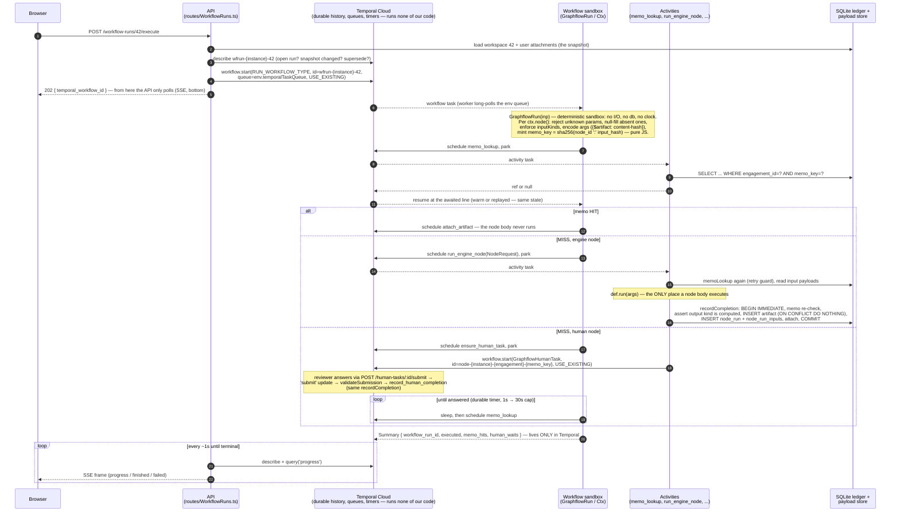

# graphflow

An engagement-scoped, memoized workflow engine for professional-services work (the demo domain is
tax preparation). Workflows are TypeScript code executed durably on Temporal; every computed
answer is filed in an insert-only SQLite ledger keyed by the question asked (node id plus
canonicalized inputs), so repeating work — re-running a workspace, copying last month's
engagement forward, re-uploading a corrected document — recomputes only what actually changed
and reuses everything else, including answers humans already gave.

This README is the technical design document. It describes the current implementation with
file and symbol anchors so a reader (or a fresh coding session) can verify every claim without
re-discovering the codebase. Operational instructions are at the end. The database schema is
transcribed in `schema.dbml`. Rules for writing about this codebase are in `AGENTS.md`.
Everything else at the repo root: `typescript_StyleAndRules/` is the snapshot of the monorepo
standards that the "Deviations" section of `backend/README.md` is written against; `agents/`,
`DO_NOT_READ*/`, and `legacy/` hold retired material and are not documentation.

**Current state (frozen 2026-07-19).** The backend is the product and is current. The frontend
(`frontend/`) predates the latest wire-contract changes and is KNOWN BROKEN against the current
API: `task_queue` and `code_hash` left the wire, and `source`, `origin`, and `input_kinds`
arrived (see "Wire contracts"), as did the additive hygiene fields (`updated_by`/`updated_at` on
artifacts/workspaces/engagements, `created_by` on engagements, `created_by`/`created_at` on node
runs, `created_at`/`updated_at` on catalog workflows; reviewer names now arrive as `user:<name>`
principals). Porting it, and all e2e work, is deliberately deferred.

## The domain model

Six concepts carry the system. Each maps to a table in `schema.dbml` (source of truth: the `SCHEMA`
constant in `backend/src/infrastructure/db/Db.ts`).

- **Engagement** (`engagements`) — the isolation boundary. Artifact identity and memo lookups
  are engagement-scoped; across engagements nothing is ever shared. One boundary serves both
  reuse and confidentiality, on purpose.
- **Artifact** (`artifacts`) — an immutable value: uploaded document, questionnaire answers, or
  a computed result. Identity is content, never provenance: `UNIQUE (engagement_id, kind, hash)`
  where `hash` is sha256 of the payload bytes. Identical bytes under one kind converge to one
  row; re-uploading the same document revives all work that consumed it. Payload bytes live
  outside the db, content-addressed at `{engagement_id}/{content_hash}` under the storage root
  (`writePayload` in `backend/src/infrastructure/storage/Storage.ts`, write-once).
- **Kind** (`kinds`) — the type of an artifact and a first-class business object. Every kind has
  an authored `source`, the channel data of that kind enters through: `upload`, `questionnaire`,
  or `email` (leaf channels: supplied by users) or `computed` (produced by nodes). `artifacts.kind` and
  `nodes.output_kind` are foreign keys into `kinds`, so an unpublished kind cannot enter the
  ledger.
- **Node** — one computation step, declared with `defineNode`/`defineHumanNode`
  (`backend/src/domain/registry/Registry.ts`). A node declares its `name` (the node id), its
  `outputKind`, and `inputKinds` — a total map from every parameter to the artifact kind it
  consumes, or `null` for a scalar argument. `inputKinds` IS the parameter declaration;
  `paramNames` is derived from its keys. The catalog mirrors nodes into the `nodes` and
  `node_input_kinds` tables.
- **Workflow** (`workflows` + `workflow_kinds`) — a versioned composition: a declared kind
  vocabulary, a node list, and a `run(ctx)` function that IS the DAG (plain TypeScript control
  flow calling `ctx.node(...)`). Declared with `defineWorkflow`; every version is listed in the
  `ALL_WORKFLOWS` manifest (`backend/src/workflows/index.ts`).
- **Workspace** (`workflow_runs` + `workflow_run_artifacts`) — the editable business layer: a
  named set of attached artifacts plus a pinboard of results. A workspace is NOT an execution
  record; executions live only in Temporal. Membership rows carry `source: user | engine`
  (workspace provenance, distinct from artifact origin); user-attach promotes an engine row
  (`source` flips, the promoter lands in the membership's `updated_*`, first-attach `created_*`
  survives), engine-attach never demotes; detaching is the only user-facing DELETE in the system.

The ledger of computations is `node_runs` + `node_run_inputs`: one `node_runs` row per DISTINCT
answered question (not per execution — memo hits insert nothing), with `node_run_inputs` holding
the consumed-artifact edges. Ledger tables are insert-only; the mutable ledger columns are
`artifacts.label` and its `updated_by`/`updated_at` stamps (`renameArtifact` in Db.ts).

### Actors and hygiene columns

Every table carries a tiered audit block (full tiering rationale in `schema.dbml` Conventions):
entity tables (`engagements`, `artifacts`, `workflow_runs`) have
`created_by`/`created_at`/`updated_by`/`updated_at`/`deleted_at`; `node_runs` has `created_*`
only (insert-only memo ledger); `workflow_run_artifacts` has `created_*` + `updated_*`
(promotion); catalog masters have `created_at` + `updated_at` (publish stamps, bumped only when
the mirrored row's own columns change — an identical republish is a no-op); `meta` and the
publish/edge mirrors are exempt. `created_*` is the FIRST filer — convergence never re-dates it;
`updated_*` is NULL until first updated (the idempotent promote/publish paths are guarded so
no-ops never stamp; request-driven rename/PATCH/archive stamp per request); `deleted_at` is
dormant (always NULL, no reader filters — reserved for a future soft delete).

Actor columns hold **principals**: `'<type>[:<name>]'` with type `user | engine | system |
agent` — e.g. `engine`, `user:thet`, `user:Priya Sharma`, `agent:auto-approver`; bare `user` is
the anonymous caller. The grammar lives in `backend/src/domain/principal/Principal.ts`
(bundle-safe) and is asserted at every Db write boundary and in the human-task submit validator.
The API wraps submitted reviewer names as `user:<name>` server-side; names are free text (colons
allowed) and — no auth existing (invariant 9) — caller-asserted: an audit trail, not an
authorization record. The reviewer principal on a human answer's `created_by` is the system's
only record of who approved it.

## The identity model (what makes reuse safe)

Two hashes define everything:

- **Artifact identity** = `(engagement_id, kind, sha256(payload bytes))`. No provenance inside.
- **Question identity (the memo key)** = `sha256(node_id ':' input_hash)` (`memoKey` in
  `backend/src/domain/canonical/Canonical.ts`), where `input_hash` is the hash of the canonical
  argument map. Engagement scoping applies at lookup via `UNIQUE (engagement_id, memo_key)` on
  `node_runs` — never inside the hash.

Consequences:

- **The node's declared name is its version identity (the naming contract).** There is no code
  hash. A behavior change — body, helper, validator, output kind, executor — REQUIRES a rename
  (`calculate_tax` → `calculate_tax_v2`); an unchanged name keeps serving previously memoized
  answers, including human ones. Nothing mechanical catches a forgotten rename; `validateCatalog`
  (Registry.ts, run by every publish) catches what it can — the same node id declared with a
  different shape (executor/outputKind/inputKinds/displayName) across workflows is a publish
  error — and the rest is contract.
- **Canonical JSON is the hashing substrate** (`canonicalBytes` in Canonical.ts): sorted keys,
  NFC-normalized strings, floats banned (money is decimal strings end to end — `DecimalString`
  helpers in `backend/src/domain/money/`). Artifact-valued arguments hash as
  `{$artifact: <content hash>}` — ids, paths, and history never enter a hash. Absent parameters
  hash as explicit `null`, so omitted/undefined/null calls produce the same key; parameter
  reordering is a memo HIT by design (sorted keys), while adding, renaming, or removing a
  parameter is a miss.
- **Provenance is derived, never stored.** `artifacts` has no producer column. The
  `artifact_facts` view (in `SCHEMA`, Db.ts) derives `produced_by_node_run` (earliest `node_runs`
  row whose `output_artifact_id` points at the artifact — several runs can converge on one
  artifact) and `origin`: `produced` when a producing run exists, else `override` for a
  hand-supplied computed kind, else the kind's authored source. Read models read the view;
  the memo and write path (`memoLookup`, `recordCompletion`, `supplyArtifact`) stays on base
  tables. Nothing
  stored can diverge from lineage.

Concrete scenario: the user attaches a corrected brokerage statement to a copied workspace and
re-executes. The OCR node's memo key changes (new `$artifact` hash) so OCR re-runs; its verify
question is new, so a reviewer is asked once; every chain fed by unchanged documents memo-hits;
the fold, calculator, and report re-run because their inputs changed; the returned `Summary`
lists exactly which node ids executed, memo-hit, and waited on humans.

## Source layout (the map)

```
backend/                    the product (Node 22+, npm — not yarn)
  src/domain/               pure + bundle-safe (imported by Temporal sandbox code; no node:*)
    canonical/Canonical.ts    canonical JSON, sha256Hex, hashValue, memoKey — the hashing contract
    registry/Registry.ts      defineNode/defineHumanNode/defineWorkflow, buildRegistry,
                              kindClasses, validateCatalog — definitions and publish validation
    money/DecimalString.ts    BigInt decimal-string arithmetic (ROUND_HALF_UP), no floats
    artifact/                 ArtifactRef (wire shape) + ArtifactHandle (loader-injected payload access)
    json/JsonValue.ts         the JSON value type + zod schema
  src/workflows/            the authored product — one folder per workflow version
    index.ts                  ALL_WORKFLOWS manifest; static imports feed the Temporal bundler
    nodes_shared/             version-spanning library (not a workflow folder — no workflow.ts):
                              enums.ts (SharedKind/SharedNodeId/SHARED_KINDS), helpers.ts,
                              one node per file (ocr_brokerage_statement.ts, ocr_payment_slip.ts,
                              verify_txns.ts, append_to_master.ts)
    tax_demo_workflow/        enums.ts (Kind/NodeId/KINDS — the version's contract) +
                              nodes_special/ (calculate_tax.ts, build_report.ts — 25%) +
                              workflow.ts (defineWorkflow + the run() DAG, nothing else)
    tax_demo_workflow_v2/     same shape: 24% rate + residency questionnaire; changed nodes are
                              RENAMED (nodes_special/calculate_tax_v2.ts, build_report_v2.ts)
  src/temporal/             the execution engine
    Workflows.ts              bundle entry; GraphflowRun + GraphflowHumanTask (function name ==
                              Temporal workflow type); queries progress/snapshot/task_info; submit update
    Context.ts                Ctx — the memoize-or-execute walk; encodeArgs; enforceInputKinds
    Activities.ts             node-side I/O: memo_lookup, attach_artifact, run_engine_node,
                              ensure_human_task, record_human_completion (keys == wire activity names)
    Runtime.ts                Temporal client/worker factories, startWorkspace dispatch,
                              adoptOpenWorkflows recovery sweep
    Ids.ts                    RUN_WORKFLOW_TYPE/HUMAN_TASK_WORKFLOW_TYPE constants + workflow-id helpers
  src/infrastructure/
    db/Db.ts                  SCHEMA (the schema source of truth), publishCatalog, supplyArtifact,
                              recordCompletion, catalogSnapshot, artifactLineage, read models
    storage/Storage.ts        content-addressed write-once payload store (local dir standing in for S3/GCS)
    env/Env.ts                zod-validated env (.env tolerated, shell wins)
  src/api/                  the HTTP layer — the only thing a frontend talks to; routes reach
                            Temporal only through the TemporalGateway seam (Deps.ts)
    App.ts                    fastify wiring, error envelope (ValidationError→422, NotFoundError→404,
                              RuntimeError with context.code SNAPSHOT_CHANGED→409)
    Bootstrap.ts              startup order: env → initDb → buildRegistry → publishCatalog →
                              client → optional embedded worker → listen
    Deps.ts                   ApiDeps + the narrow TemporalGateway seam (what tests stub)
    Schemas.ts / Serializers.ts  zod request schemas + row→wire mappers (wire is snake_case)
    routes/                   Catalog, Engagements, Artifacts, WorkflowRuns (execute/status/SSE), HumanTasks
  src/cli/                  init / worker / demo / seed / tasks / submit / show / download
                            (Inbox.ts holds the demo auto-approver, hardwired to verify_txns)
  src/shared/errors/        Errors.ts — the whole error taxonomy: ValidationError, NotFoundError,
                            RuntimeError, isSqliteConstraintError (local mirror of
                            @multiplier/lib-shared-errors; do not add other error classes)
  src/index.ts              the process entry (npm run dev/start) + the package barrel for the
                            monorepo move (exports buildApp, bootstrap, ApiDeps, TemporalGateway)
  scripts/check-workflows.ts  layout discipline (see below); cleanup-temporal.ts (e2e teardown)
  sample_docs/              mock "PDF" documents (.txt) used by seed/demo/tests
frontend/                   Next.js UI — currently behind the wire contract, port deferred
schema.dbml                 the schema, transcribed from SCHEMA in Db.ts (kept in sync by hand)
```

Layout contracts, enforced by `npm run check:workflows` (`backend/scripts/check-workflows.ts`):
a workflow folder is a directory under `src/workflows/` containing a `workflow.ts`; its name IS
the workflow id; every such folder is listed in `ALL_WORKFLOWS` and vice versa; and every node
owns a file named after its node id — `nodes_shared/<node_id>.ts` or
`<workflow_id>/nodes_special/<node_id>.ts` (the check is existence-only; one-file-exactly is
convention). Publish never reads the filesystem, so an unlisted
folder would silently never publish — this script is the guard.

**The sharing contract** (`nodes_shared/enums.ts` states it in code): the memo key is global by
node name, so same-named nodes across workflows were always one question universe — shared nodes
make the source match that. One name, one behavior, everywhere: an edit to a shared node changes
every workflow that lists it, so a behavior change there forces a rename, which re-executes in
every importing workflow. Versioned behavior lives only in `nodes_special/`. Vocabularies are
`as const` objects (not TS enums) because per-workflow vocabularies are composed by spreading
`SharedKind`/`SHARED_KINDS`; no raw kind or node-id string literals appear at definition sites.

## The catalog (publish)

`publishCatalog` (Db.ts) mirrors the in-memory registry into the db at every boot and `cli init`.
First it runs `validateCatalog` (Registry.ts) over the registry — never over possibly-stale db
rows. Checks: no duplicate kind declarations per workflow; every `outputKind` and consumed kind
is declared; authored source reconciles with the derived class (`kindClasses`: a kind is
`computed` iff some node in the workflow produces it — a produced kind must be authored
`computed`; an unproduced `computed` kind must be flagged `intake: true`, meaning another
workflow's output attached as input); one kind = one source+display globally; one node id = one
declared shape globally.

Then, in one transaction: `workflows` and `kinds` and `nodes` are upsert-only (retired rows
persist — they are FK parents of the ledger, and a workspace pointing at a retired workflow must
fail loud, not vanish); `workflow_kinds` (membership) and `node_input_kinds` (param → kind) are
DELETE-then-INSERT, so declarations removed from code stop lingering. `catalogSnapshot` (Db.ts)
serves the mirror with `leaf` derived per workflow in SQL (no node of the workflow produces the
kind) — leafness is never stored. Known accepted skew: retired `nodes` rows still count as
producers in that derivation until a db reset.

## How a run executes



The same walk in prose:

1. `POST /workflow-runs/:id/execute` (routes/WorkflowRuns.ts) refuses a workspace with zero
   user attachments, then calls the gateway's `startWorkspace` (Deps.ts → Runtime.ts).
2. `startWorkspace` loads the snapshot (user-sourced attachments, hash-ordered), verifies the
   workflow is in the catalog, and starts Temporal workflow type `RUN_WORKFLOW_TYPE`
   (`'GraphflowRun'`, Ids.ts) on the env task queue with workflow id
   `wfrun-{instance}-{workflow_run_id}` and conflict policy USE_EXISTING. Dispatch metadata
   lives nowhere in the db: run and recovery agree on the env queue by construction. If a run is
   already open: unchanged snapshot attaches idempotently (double-click safety); changed
   snapshot throws `SNAPSHOT_CHANGED` (API → 409) unless `supersede=true`, which terminates the
   stale run and restarts.
3. `GraphflowRun` (Workflows.ts) executes in the deterministic sandbox — no I/O, no clock, no
   db. It resolves the workflow from the compiled-in registry and calls its `run(ctx)`.
4. `Ctx.node(def, args)` (Context.ts) is the walk, per node call: verify the node is registered
   for this workflow; reject unknown parameters; null-fill absent ones; enforce `inputKinds`
   (every artifact argument must carry the declared kind — single, list, or nested; scalar
   params accept no artifacts); encode arguments three ways (hash form, transport form, input
   artifact ids); mint `memo_key = sha256(node_id ':' input_hash)`; ask the `memo_lookup`
   activity. Hit → attach the existing artifact to the workspace and return its handle — the
   node body never runs. Miss + engine node → `run_engine_node` activity executes the body
   node-side and files the completion. Miss + human node → `ensure_human_task` starts a
   `GraphflowHumanTask` workflow (id `node-{instance}-{engagement}-{memo_key}`, USE_EXISTING —
   one open task per distinct question), then the run polls the memo with capped backoff
   (1s → 30s) as a durable timer until the answer appears.
5. `recordCompletion` (Db.ts) is the one atomic, idempotent completion transaction: re-check
   the memo (activity-retry guard), assert the output kind is `computed` (runs may not produce
   leaf kinds), insert the artifact (`ON CONFLICT (engagement_id, kind, hash) DO NOTHING` — the
   convergence path), insert the `node_runs` row (SQLite assigns the id) and `node_run_inputs`,
   attach to the requesting workspace. A lost race on `UNIQUE (engagement_id, memo_key)`
   resolves to the winner via the catch path. `run_engine_node` byte-encodes results by
   contract: `Uint8Array` → octet-stream, string → text/plain, anything else must canonicalize
   (Activities.ts, `toOutputBytes`).
6. Human answers: the inbox is a Temporal visibility query (`listTaskWorkflows` in Deps.ts —
   task queue + type + Running), filtered by the instance's workflow-id prefix in
   routes/HumanTasks.ts and enriched per task via the 5s-deadline `task_info` query. `POST /human-tasks/:task_id/submit` executes the
   `submit` update; `validateSubmission` (Workflows.ts) rejects synchronously — required keys,
   canonicalizability, then the node's `resultValidator` (e.g. `validateVerifiedTxns` in
   `nodes_shared/verify_txns.ts`) — so a malformed answer returns 422 and the task stays open;
   accepted answers are memoized forever. A task whose question was answered elsewhere
   self-completes via its first-step memo check.
7. Progress streams over SSE (`/workflow-runs/:id/progress`, routes/WorkflowRuns.ts): describe +
   `progress` query each ~1s until terminal. The per-run `Summary { workflow_run_id, executed,
   memo_hits, human_waits }` lives only in Temporal — never in SQLite.
8. Worker recovery: on startup `adoptOpenWorkflows` (Runtime.ts) signals this instance's open
   workflows so their stickiness transfers off the dead worker's queue instead of stalling
   queries.

## Supplying artifacts

`POST /engagements/:id/artifacts` (routes/Artifacts.ts) accepts a multipart upload with a `kind`
field. `supplyArtifact` (Db.ts) rejects kinds absent from the published vocabulary BEFORE
writing the payload (no orphaned blobs). Supplying a `computed` kind stays legal — hand-staging a
corrected intermediate is supported and derives `origin: 'override'`.

The questionnaire channel: with multipart field `canonical_json=true`, the route parses the
upload as JSON and re-serializes through `canonicalBytes` before supply
(`canonicalizeIfRequested`, routes/Artifacts.ts) — the frontend is forbidden from producing
canonical JSON. A re-answered identical questionnaire (any key order, any whitespace) therefore
converges on the same artifact and revives every downstream memo hit.
`tax_demo_workflow_v2` demonstrates it end to end: `residency_answers` (source `questionnaire`)
feeds `calculate_tax_v2`. `email` is a declared source value with no channel behind it yet.

## Wire contracts

Wire JSON is snake_case (mapping in `backend/src/api/Serializers.ts` and the transport types);
internal identifiers are camelCase. The shapes a frontend consumes:

- **Catalog** (`GET /catalog`, `CatalogWorkflowOut` in Schemas.ts): per workflow —
  `superseded_by` (derived from the `_v{n}` id convention, routes/Catalog.ts); `created_at` /
  `updated_at` publish stamps (workflow level only); kinds with `source` (authored) and `leaf`
  (derived boolean); nodes with `output_kind` and `input_kinds` (param → kind | null — enough to
  render the dataflow graph without executing it). No `task_queue`, no `code_hash`.
- **Artifacts** (`ArtifactMetaOut`, Serializers.ts): `created_by`/`created_at` (first-filer
  principal + time) and `updated_by`/`updated_at` (label renames); `produced_by_node_run` and
  `origin` (`produced | upload | questionnaire | email | override`) — both derived by
  `artifact_facts`; `payload_available` derived from `payload_ref`, which is never exposed.
  Lineage (`GET /artifacts/:id`) serves `produced_by` + `consumed_by` as node runs.
- **Members** (`MemberOut`, workspace detail): an artifact's meta PLUS the membership columns —
  the ONE deliberate exception to wire-key == column-name: the membership's `created_by`/
  `created_at` are served as `added_by`/`added_at` (the joined row already carries the
  artifact's own `created_*`). Members list in first-attach order; promotion is signaled by
  `source`, and `deleted_at` never appears on any wire shape.
- **Node runs** (`NodeRunOut`): `node_id`, `memo_key`, `temporal_id`, `created_by`/`created_at`
  (the filing stamp — equals the output artifact's on a fresh completion), `input_artifact_ids`,
  and the output artifact. No `code_hash`.
- **Human tasks** (`HumanTaskOut`): task workflow id, node display/instructions, transport
  payload (artifact refs as `{__artifact__: ...}`), `result_required_keys`.
- **Errors**: `{ detail }` envelope; 422 validation, 404 not found, 409 only for
  `SNAPSHOT_CHANGED` (App.ts).

## Standing invariants (enforce in any change)

1. Identity is content, never provenance; engagement scoping applies at lookup, never inside a
   hash. Paths, refs, ids, and workspaces never enter memo keys or artifact identity.
2. The ledger is insert-only in content; the mutable ledger columns are `artifacts.label` and
   its `updated_*` stamps. `created_*` is immutable everywhere — convergence keeps the first
   filer. The only DELETEs in the system: workspace detach (user-facing) and the publish
   transaction rewriting the `workflow_kinds`/`node_input_kinds` mirrors. `deleted_at` columns
   are dormant (reserved; nothing sets or filters them).
3. Behavior change ⇒ node rename. Shared code (`nodes_shared/`) must never carry versioned
   behavior.
4. Config/scenario deltas enter computations only as arguments or artifacts — never ambient.
5. Exactly two Temporal workflow types (`GraphflowRun`, `GraphflowHumanTask`); queues select
   fleets, namespaces select tenancy. New types only for new orchestration shapes.
6. Sandbox purity: `src/domain/`, `src/workflows/`, `Context.ts`, `Workflows.ts` import no
   `node:*` and do no I/O, colocated `*.test.ts` files excepted (tests never enter the Temporal
   bundle); every db/storage/client touch is an activity.
7. No floats in payloads, ever; money is decimal strings (`DecimalString`).
8. Schema changes update `schema.dbml` in the same change. Greenfield mode: schema edits ship
   as reset (`npm run seed -- --fresh`), no migrations yet. The hygiene-column change relies on
   this: new code against a pre-hygiene db fails loud at boot (publishCatalog hits the missing
   columns) — reset, don't patch.
9. No auth anywhere by design (loopback bind is the only guard) — do not ship this exposed.
   Corollary: actor columns are caller-asserted audit data, never authorization input — nothing
   may branch on `created_by`/`updated_by`.
10. Actor values are principals `'<type>[:<name>]'` (type `user | engine | system | agent`),
    asserted at every Db write boundary (`assertPrincipal`); boundaries that accept bare names
    (submit routes, CLI `--reviewer`) wrap them as `user:<name>` before anything downstream.

## Testing

`npm run check` = typecheck + tests + lint (biome, warnings fatal) + `check:workflows`. One
suite alone: `npm run test -- src/infrastructure/db/Db.test.ts` (plus `test:watch`,
`test:coverage`). Suites (vitest, all colocated):

- `Canonical.test.ts`, `DecimalString.test.ts`, `Env.test.ts`, `Storage.test.ts` — pure units.
- `Registry.test.ts` — definition factories, `kindClasses`, every `validateCatalog` rule
  (one negative test per rule), registry lookup.
- `Context.test.ts` — `enforceInputKinds` and the `Ctx` guards (everything that fires before an
  activity call; the happy path needs a live activity proxy).
- `Db.test.ts` — ledger semantics (revive, convergence, idempotent completion, derived origin,
  reverse-edge lineage, input edges), hygiene semantics (first-filer `created_*`, stamped
  updates, promotion provenance, dormant `deleted_at`, principal guards at every write boundary)
  and publish semantics (mirror rewrite, validation gating, guarded republish stamps, snapshot
  ordering, display fallback). `Principal.test.ts` pins the principal grammar itself.
- `TaxDemoNodes.test.ts` — node bodies as pure functions against `sample_docs/`, byte-exact
  golden reports, the manifest/vocabulary/rename assertions.
- `ApiCrud.test.ts` — the API over a real app + scratch db with a stub `TemporalGateway`:
  catalog shape, upload/attach/revive, supply guard, canonical_json convergence, origins, the
  hygiene wire surface (stamps exposed, `deleted_at` never, the member `added_*` alias, stable
  first-attach member order across promotion).
- `ApiIntegration.test.ts` — the full story over real Temporal Cloud; auto-skipped without
  `TEMPORAL_API_KEY` in `backend/.env`. This is the only coverage of the dispatch path and live
  memo replay; its memo-hit counts are the regression suite for the memo-key formula.

## Known accepted gaps (decisions, not oversights)

- No mechanical tripwire for a behavior change under an unchanged node name; the shape check in
  `validateCatalog` is the mechanical remnant, the naming contract is the rest. This replaced a
  build-time source-hashing scheme (per-node code hashes in the memo key) that was rejected:
  byte identity is not semantic identity, and it trusted authors to declare every dependency
  anyway.
- Per-workflow dispatch pinning (a stored workflow type and task queue per catalog row) was
  removed deliberately: every row held the same constant, and a stale stored queue could start a
  run where no recovery sweep looks. If an incompatible-engine cutover ever needs pinning, it
  gets designed then.
- Retired `nodes` rows persist (upsert-only) and skew the derived `leaf` until a reset.
- `TEMPORAL_TASK_QUEUE` defaults to a personal dev queue name (Env.ts); the env var is the sole
  dispatch truth, so set it deliberately per deployment.
- The one-node-one-file check is existence-only (no source parsing since the codegen died).
- Temporal histories survive a db reset; `seed --fresh` terminates the old instance's open runs,
  `scripts/cleanup-temporal.ts` does the same for e2e stacks.

## Running it

Every env var has a dev default (`EnvSchema` in Env.ts), so a bare start works against a local
Temporal server: `TEMPORAL_ADDRESS=localhost:7233`, `TEMPORAL_NAMESPACE=default`,
`TEMPORAL_TASK_QUEUE` (a personal dev queue name — set it deliberately), `TEMPORAL_API_KEY`
unset (present = Temporal Cloud with TLS), `GRAPHFLOW_DB=graphflow.sqlite3`,
`GRAPHFLOW_STORAGE=mock_s3_gcs`, `GRAPHFLOW_EMBED_WORKER=1`, `GRAPHFLOW_CORS_ORIGINS`,
`GRAPHFLOW_HOST=127.0.0.1`, `PORT=8000`. Overrides live in `backend/.env`; shell wins over
`.env`.

```
cd backend
npm install
npm run check              # typecheck + tests + lint + workflow-folder discipline
npm run cli -- demo        # the end-to-end story against real Temporal (in-process worker + auto-approver)
npm run seed -- --fresh    # reset db + payload store, terminate stale runs, seed the demo dataset
                           # (REQUIRED once when pulling a schema change — boot fails loud on a stale db)
npm run dev                # the API on :8000 (+ embedded worker)
```

The seed dataset (`cmdSeed` in backend/src/cli/Seed.ts): engagement "Acme Ltd" with workspace
"January estimate" (`tax_demo_workflow`, six sample docs, executed to completion — the auto-
approver answers the verify tasks) and "February estimate" (a copy of January plus two extra
docs, deliberately NOT executed — the staged memo-reuse demo); engagement "Blue Harbour LLP"
with "Q1 estimate" (`tax_demo_workflow_v2`, including the canonicalized residency
questionnaire), started and left waiting on two open `verify_txns` tasks — the live human-task
fixture.

`npm run cli -- <cmd>` also offers `init | worker | tasks | submit <task-workflow-id> |
show <workflow_run_id> | download <artifact_id> <out>`. `submit` auto-approves a `verify_txns`
task unchanged (`buildApproval` in cli/Inbox.ts understands only that payload shape); a custom
or corrected answer goes through `POST /human-tasks/:task_id/submit`. Never hand-delete the
payload store while keeping the db (or vice versa) — reset both together with `seed --fresh`.

Backend `node_modules/` is machine-specific (better-sqlite3 native build): if imports fail after
switching machines, delete it and `npm install`. Monorepo-migration notes and deliberate
deviations from the monorepo standards live in `backend/README.md`.
